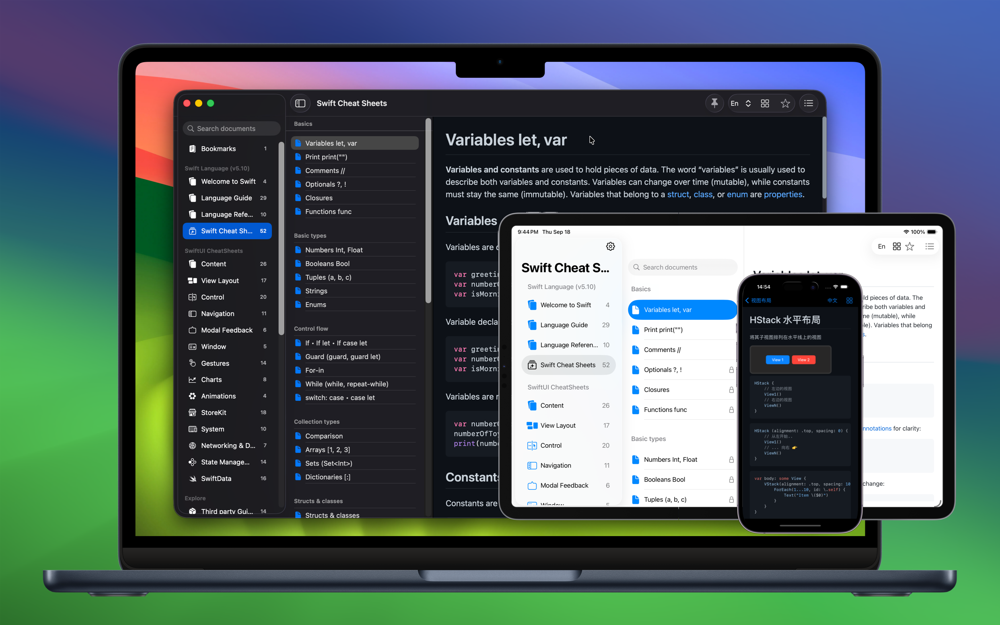

	 
	 
	
	<h1>DevTutor for SwiftUI</h1>
  <!--rehype:style=border: 0;-->
  

		<a href="./README.zh.md">中文</a> • 
		<a href="#frequently-asked-questions">FAQ</a> • 
		<a target="_blank" href="https://wangchujiang.com/#/contact">Contact & Support</a>
  

  

    
    
  

minimum OS requirement: `macOS 14.0` / `iOS 17.0`

"DevTutor for SwiftUI" is an application designed to assist developers in creating exceptional apps using SwiftUI. It offers replicable code samples and corresponding UI previews to streamline your coding process. Additionally, it includes local offline access to the official Swift Programming Language documentation in both Chinese and English.

## Main Features

- Provide sample code that can be used directly in your project
- View in real time how your code affects the appearance of the application
- Provide official bilingual Chinese and English Swift programming language documentation for offline use
- Explore a collection of third-party packages, see [Explore Data](https://github.com/jaywcjlove/swiftui-tutorial/blob/main/data/explore.json)
- And more features...

## About SwiftUI

SwiftUI is an innovative, declarative UI framework developed by Apple for building interfaces across iOS, macOS, watchOS, and tvOS. Launched in 2019, its goal is to simplify the development of cross-platform applications. Using the Swift programming language, developers can describe the elements and layout of user interfaces declaratively.

## Frequently Asked Questions

### Who is it for?

SwiftUI is suitable for developers of all levels, from beginners to experienced professionals, all of whom can benefit from it. Here are some groups that might find learning and using SwiftUI particularly advantageous:

1. **Beginner Developers**: SwiftUI's declarative syntax is easier to learn compared to traditional imperative programming because it's more intuitive. Developers just need to describe what the UI should look like, not how to implement it. This makes it easier for beginners to get started and see results quickly.
2. **Experienced iOS/macOS Developers**: For those already familiar with the Apple ecosystem and Swift language, SwiftUI offers a more modern, efficient way to build user interfaces. It can also help them streamline their existing UIKit or AppKit code towards a more modular and reusable design.
3. **Cross-Platform Application Developers**: Developers planning to create applications that run across iOS, macOS, watchOS, and tvOS will benefit from SwiftUI's cross-platform capabilities. Using the same codebase can significantly reduce development and maintenance costs.
4. **UI/UX Designers**: For designers looking to translate designs directly into code, SwiftUI's real-time previews and declarative syntax allow them to iterate designs quickly and see their implementation in real-time.
5. **Professionals Looking to Increase Productivity**: SwiftUI's efficient features, such as real-time previews and declarative syntax, can significantly speed up development time and reduce debugging, allowing professionals to release products faster.

In summary, SwiftUI's design philosophy and tool support make it a widely popular framework, valuable to anyone interested in programming, whether they are beginners or experienced professionals looking to enhance development efficiency and quality.

### What can it be used for?

SwiftUI can be used to develop a wide variety of applications for Apple's multiple platforms, including iOS, macOS, watchOS, and tvOS. Here are some specific types of applications that can be developed using SwiftUI:

1. **Mobile and Tablet Applications**: With SwiftUI, developers can create beautiful, responsive applications for iPhones and iPads. Whether it's social media apps, e-commerce platforms, or health and fitness trackers, SwiftUI provides all the necessary interface components and animations.
2. **Desktop Applications**: macOS applications can also be built using SwiftUI. These applications can range from simple utility software to complex editing tools, with SwiftUI providing everything needed to create professional-level desktop applications.
3. **Wearable Device Applications**: For Apple Watch, SwiftUI allows developers to design interactions for small screens. These applications are often used for quick information displays, health monitoring, or as an extension of smartphone applications.
4. **TV Applications**: On Apple TV, developers can use SwiftUI to create large-screen entertainment and multimedia applications, such as streaming apps or games.
5. **Multi-Platform Applications**: SwiftUI's cross-platform features enable developers to create a unified application experience across all of Apple's devices, simplifying the development process and ensuring consistency across platforms.
6. **Educational and Training Applications**: Educational applications can also leverage SwiftUI's interactivity and appeal to provide dynamic learning experiences, such as interactive textbooks and learning games.
7. **Corporate Internal Applications**: Companies can develop applications for internal use, such as employee communications, project management tools, or customer relationship management systems, all optimized through SwiftUI's design and functionality.
8. **Prototype Design and Testing**: SwiftUI's rapid iteration capabilities and real-time previews make it an ideal choice for quick prototype design. Designers and developers can quickly build and test interface designs, accelerating the development process.

SwiftUI's flexibility and ease of use make it a powerful tool for developing modern, responsive applications. Whether for personal projects or professional development, SwiftUI meets a variety of needs and expectations.

<!--idoc:config:
title: DevTutor for SwiftUI is an application designed to assist developers in creating exceptional apps using SwiftUI - 
-->