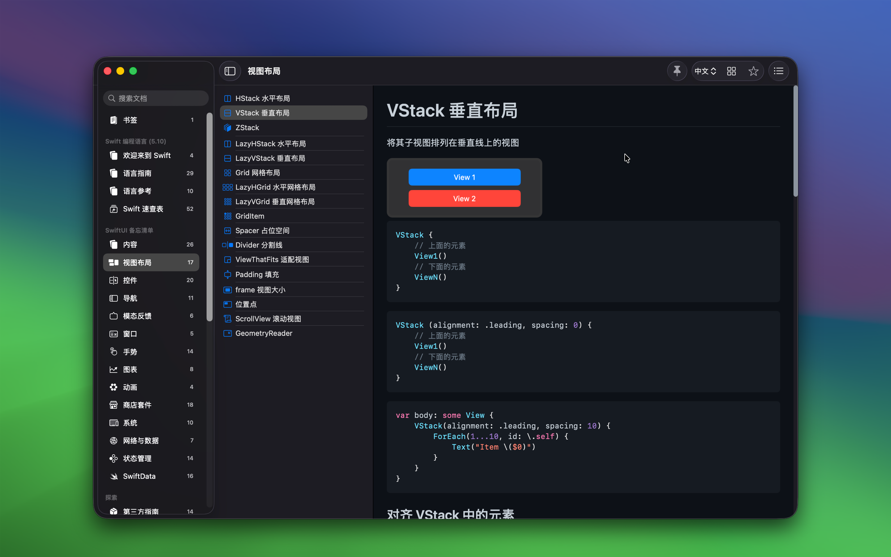
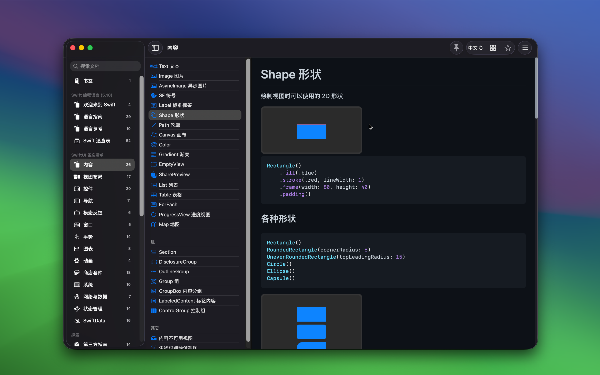
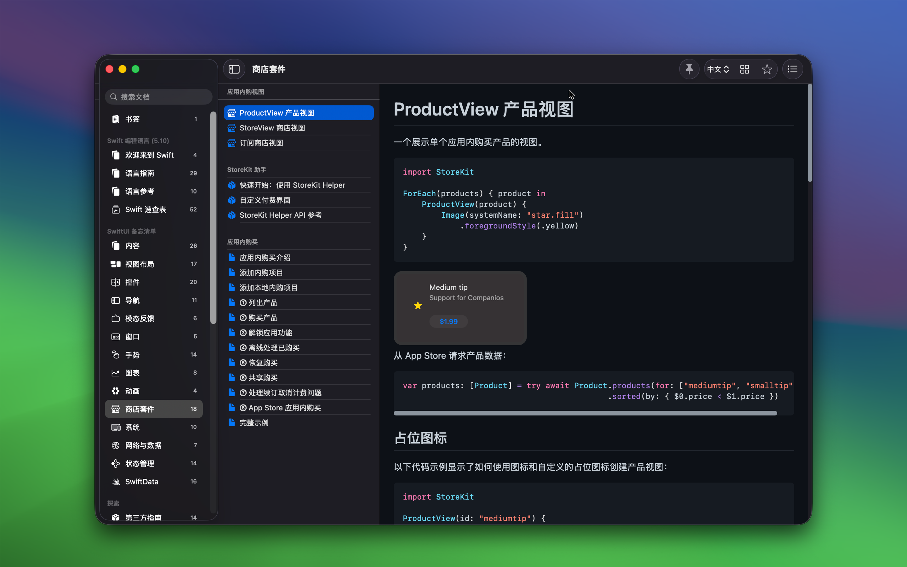

	 
	 
	
	<h1>SwiftUI 教程</h1>
  <!--rehype:style=border: 0;-->
  

		<a href="./README.md">English</a> • 
		<a href="#常见问题解答">常见问题</a> • 
		<a target="_blank" href="https://wangchujiang.com/#/contact">联系&支持</a>
  

  

    
  

「SwiftUI 教程」是一款旨在帮助开发者使用 SwiftUI 创建出色应用程序的应用。它提供可复制的代码示例和相应的用户界面预览，以简化您的编码过程。此外，还包括了《Swift 编程语言》官方中英文文档的本地离线预览。

## 主要功能

- 提供可直接在您的项目中使用的样本代码
- 实时查看您的代码如何影响应用的外观
- 提供官方中英文 Swift 编程语言离线文档
- 探索第三方包集合，详见 [探索数据](https://github.com/jaywcjlove/swiftui-tutorial/blob/main/data/explore.json)
- 以及更多功能...

## 关于 SwiftUI

SwiftUI 是苹果公司开发的一个创新、申明式的 UI 框架，用于在 iOS、macOS、watchOS 和 tvOS 上构建用户界面。它于 2019 年发布，目标是简化跨平台应用程序开发的过程。SwiftUI 使用 Swift 编程语言，允许开发者以申明式语法来描述用户界面的元素和布局。

## 常见问题解答

### 适合什么样的人？

SwiftUI 适合各种水平的开发者，从初学者到有经验的专业人士，都可以从中受益。以下是一些可能特别适合学习和使用 SwiftUI 的不同群体：

1. **新手开发者**：SwiftUI 的申明式语法相比较传统的命令式编程更易学习，因为它更加直观，开发者只需描述 UI 应该呈现的样子，而不是如何实现。这使得初学者更容易上手，并快速看到成效。
2. **有经验的 iOS/macOS 开发者**：对于已经熟悉 Apple 生态系统和 Swift 语言的开发者，SwiftUI 提供了一种更现代、高效的方式来构建用户界面。它还能帮助他们简化现有的 UIKit 或 AppKit 代码，转向更加模块化和可复用的设计。
3. **跨平台应用开发者**：开发者计划开发可以在 iOS、macOS、watchOS 和 tvOS 上运行的应用程序将受益于 SwiftUI 的跨平台特性。使用同一套代码基础，可以大大减少开发和维护成本。
4. **UI/UX 设计师**：对于希望将设计直接转化为代码的设计师，SwiftUI 的实时预览和申明式语法使他们可以快速迭代设计，并直观地看到其实现效果。
5. **想要提高生产力的专业人士**：SwiftUI 的高效特性（如实时预览和申明式语法）可以显著提高开发速度，减少调试时间，使得专业开发者能够更快地发布产品。

总之，SwiftUI 的设计理念和工具支持使它成为广泛受欢迎的框架，无论是对编程感兴趣的新手，还是希望提升开发效率和质量的经验丰富的专业人士，都能从中找到价值。

### 可以用来做什么？

SwiftUI 可以用于开发各种类型的应用程序，适用于 Apple 的多个平台，包括 iOS、macOS、watchOS 和 tvOS。以下是一些可以利用 SwiftUI 开发的具体应用类型：

1. **手机和平板应用**：使用 SwiftUI，开发者可以为 iPhone 和 iPad 创建美观、响应灵敏的应用程序。无论是社交媒体应用、电子商务平台还是健康与健身追踪器，SwiftUI 都能提供所需的界面组件和动画。
2. **桌面应用**：macOS 应用程序同样可以利用 SwiftUI 构建。这些应用程序可以从简单的实用工具软件到复杂的编辑工具等不等，SwiftUI 提供了创建专业级桌面应用所需的一切功能。
3. **可穿戴设备应用**：对于 Apple Watch，SwiftUI 允许开发者设计小屏幕交互。这些应用通常用于快速信息显示、健康监测或作为智能手机应用的延伸。
4. **电视应用**：在 Apple TV 上，开发者可以使用 SwiftUI 创建大屏幕的娱乐和多媒体应用，如视频流应用或游戏。
5. **多平台应用**：SwiftUI 的跨平台特性使得开发者可以为 Apple 的所有设备创建统一的应用体验，从而简化开发过程，并确保各平台间的高度一致性。
6. **教育和培训应用**：教育应用也可以利用 SwiftUI 的互动性和吸引力，提供动态的学习体验，如互动教科书、学习游戏等。
7. **企业内部应用**：公司可以开发内部使用的应用程序，如员工通讯、项目管理工具或客户关系管理系统，这些都可以通过 SwiftUI 实现优化设计和功能。
8. **原型设计和测试**：SwiftUI 的快速迭代能力和实时预览特性使其成为快速原型设计的理想选择。设计师和开发者可以迅速构建和测试界面设计，加速开发过程。

SwiftUI 提供的灵活性和易用性使其成为开发现代、响应快速的应用程序的强大工具。无论是个人项目还是专业开发，SwiftUI 都能满足不同的需求和预期。